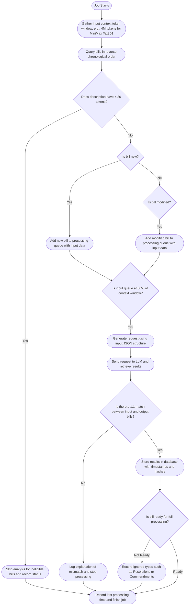

```mermaid
flowchart TD
    start([Job Starts])
    gather_context([Gather input context token window, e.g., 4M tokens for MiniMax Text 01])
    query_bills([Query bills in reverse chronological order])
    check_tokens{Does description have < 20 tokens?}
    skip_ineligible([Skip analysis for ineligible bills and record status])
    check_new{Is bill new?}
    add_to_queue_new([Add new bill to processing queue with input data])
    check_modified{Is bill modified?}
    add_to_queue_modified([Add modified bill to processing queue with input data])
    input_limit{Is input queue at 80% of context window?}
    generate_request([Generate request using input JSON structure])
    process_llm([Send request to LLM and retrieve results])
    validate_llm_response{Is there a 1:1 match between input and output bills?}
    log_error([Log explanation of mismatch and stop processing])
    store_results([Store results in database with timestamps and hashes])
    check_full_processing{Is bill ready for full processing?}
    record_ignored_types([Record ignored types such as Resolutions or Commendments])
    job_end([Record last processing time and finish job])

    %% Define connections
    start --> gather_context
    gather_context --> query_bills
    query_bills --> check_tokens
    check_tokens -- Yes --> skip_ineligible
    check_tokens -- No --> check_new
    check_new -- Yes --> add_to_queue_new
    check_new -- No --> check_modified
    check_modified -- Yes --> add_to_queue_modified
    add_to_queue_new --> input_limit
    add_to_queue_modified --> input_limit
    input_limit -- Yes --> generate_request
    generate_request --> process_llm
    process_llm --> validate_llm_response
    validate_llm_response -- No --> log_error
    validate_llm_response -- Yes --> store_results
    store_results --> check_full_processing
    check_full_processing -- Not Ready --> record_ignored_types
    check_full_processing -- Ready --> job_end
    skip_ineligible --> job_end
    record_ignored_types --> job_end
    log_error --> job_end

```