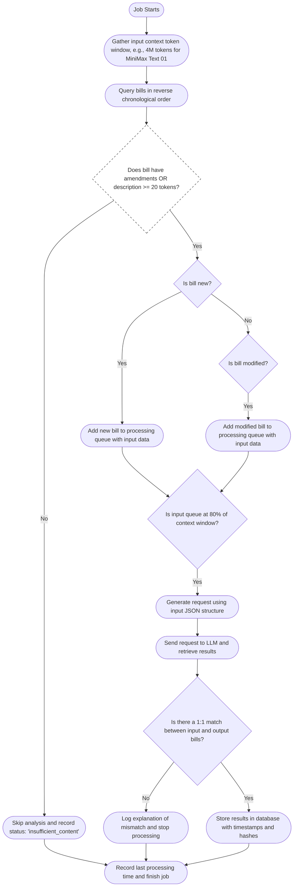

### Key Changes:
- Modified content check to include amendments
- Bills with amendments will be analyzed even if description is short
- Content from both description and amendments will be included in analysis input
- Skip only if both description is short AND no amendments exist
