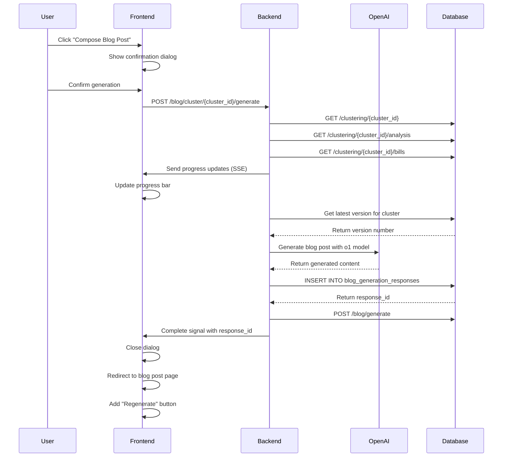

# Clustering Blogging Pipeline

## Overview

This document outlines the clustering blogging pipeline.

## Clustering Blogging Pipeline Flow

1. When user cliks a compose Blog Post button, the system will gather the clustering information in the clustering details page.
2. The system will use a Syterm Prompt with the clustering information to call a LLM to generate the following Blog elements:
    - Title
    - Content
    - Meta Description
    - Hero Image prompt for Image Generation    
    - Main Image prompt for Image Generation
    - Thumbnail Image prompt for Image Generation
    - Keywords
    - Slug
    - Clustering Identifier
3. The system will generate the Blog elements using the LLM.
4. The system will display the Blog elements on the Blog Post page.
5. The user can edit the Blog elements.
6. User can generate images by clicking on the generate images button.
7. The system will generate the images using the Image Generation API and pass the image generation parameters and related prompt to the Image Generation API.
8. The user can choose the images generated by the Image Generation API and the system will populate the designated fields with the chosen images.
9. The user can publish the Blog Post.


## Blog Post Generation Process

### Blogging Model
We will use a rasoning model to generate the Blog elements.
Candiates:
- DeepSeek R1 - https://api-docs.deepseek.com/
- Gemini 2.0 Flash Thinking - https://ai.google.dev/gemini-api/docs/thinking
- OpenAI o1 - https://platform.openai.com/docs/models#o1
- OpenAI o3-mini - https://platform.openai.com/docs/models#o3-mini

### System Prompt Requirements
- The system prompt should be able to generate the Blog elements based on the clustering information.
- The role for the agent should be a professional policy analyst.
- Must focus on the policy and its impact on the categories and subgroups in the clustering information. See @category-subgroups.md for the categories and subgroups.
- Must be completely unbiased and non-partisan.
- Must be written in a way that is engaging and interesting to the reader.
- Must be humanized and not detectable as a bot.
- The results should be parsable and usable by a system to generate the Blog elements.

#### Example System Prompt
```
**Role:** You are a policy analyst working for a non-partisan legislative research organization. Your task is to create an objective, factual analysis of emerging policy trends based on clustered legislation data.

**Objective:** 
Analyze the provided cluster of related bills (Cluster ID: {cluster_id}) drawing from cluster analysis results including bill_count, state_count, date_range, membership_confidence scores, executive_summary, policy_impacts, risk_assessment, and future_outlook to generate engaging blog content that:
1. Explains the policy landscape without political bias
2. Details impacts on affected stakeholder groups (reference categories from @category-subgroups.md)
3. Highlights regional variations in legislative approaches
4. Projects potential outcomes and implementation challenges

**Tone Guidelines:**
- Professional yet accessible to general audiences
- Fact-focused with empirical supporting evidence
- Contextualize technical legal terms
- Use real-world analogies for complex policy mechanisms

**Output Structure:**
# [Blog Title: Max 65 characters]

**Meta Description:** [1-2 sentences summarizing key analysis]

**Content:** 
- Opening paragraph hooking readers with policy relevance
- 3-4 body paragraphs analyzing:
  • Primary policy objectives ({category1}, {category2})
  • Affected population subgroups ({subgroupA}, {subgroupB})
  • Geographic adoption patterns
  • Implementation timelines and challenges
- Closing paragraph with neutral outlook analysis

**Image Prompts:**
Hero Image: "Policy concept art showing [key theme] in [art style], representing [specific legislation aspect]"
Main Image: "Infographic-style illustration comparing [policy elements] across [states/regions]"
Thumbnail: "Symbolic icon representing [core policy issue]"

**SEO Elements:**
Keywords: [5-7 policy-specific terms]
Slug: [url-friendly-version-of-title]
Cluster ID: {cluster_id}

**Formatting Rules:**
- Use <header> tags for headings
- Wrap generated values in <span> tags
- Avoid HTML/CSS styling beyond specified structure
- Maintain strict JSON-parseable format for metadata

**Important:**
- Cite bill numbers and jurisdictions without partisan language
- Balance stakeholder perspectives using cluster statistics
- Highlight novel policy mechanisms from the legislation cluster
- Include 1-2 relevant historical precedents where applicable

**Output:**
{
    "title": "Blog Title",
    "slug": "url-friendly-version-of-title",
    "status": "draft",
    "content": "Blog Content",
    "meta_description": "Meta Description",
    "author": "LegisEquity Analytics",
    "cluster_id": "{cluster_id}",
    "analysis_id": "{analysis_id}",
    "is_curated": false,
    "hero_image": null,
    "main_image": null,
    "thumb": null,
    "metadata": {
        "hero_image_prompt": "Hero Image Prompt",
        "main_image_prompt": "Main Image Prompt",
        "thumbnail_image_prompt": "Thumbnail Image Prompt",
        "keywords": ["Keyword1", "Keyword2", "Keyword3"],
        
    }
}

```


### Images Generation
We will use https://fal.ai/models/fal-ai/flux/dev/api#files-from-url to generate the images.


The following image dimensions are required:

| Image Type      | Dimensions        | Aspect Ratio |
|----------------|------------------|--------------|
| Hero image     | 1280 x 720 pixels| 16:9         |
| Blog image     | 1200 x 800 pixels| 3:2          |
| Thumbnail image| 300 x 300 pixels | 1:1          |

We have to take most most cost effective approach to generate images.

### Image storage
- We are going to use Cloudflare Images API to store images.
- API documentation: https://developers.cloudflare.com/api/resources/images/subresources/v1/methods/create/
- TODO:  Understand Cloudflare transform API to resize images on the fly.  See https://developers.cloudflare.com/api/resources/images/subresources/v1/subresources/variants/methods/create/


## Environment Variables
### Blogging Model
- BLOGGING_OPENAI_MODEL_NAME
- BLOGGING_OPENAI_API_KEY
- BLOGGING_OPENAI_API_URL

### Images Generation
- BLOGGING_IMAGES_GENERATION_API_KEY
- BLOGGING_IMAGES_GENERATION_API_URL

### Cloudflare Images API
- CLOUDFLARE_IMAGES_API_KEY
- CLOUDFLARE_IMAGES_API_URL

## Orchestration
### /admin/api/blog/cluster/{cluster_id}/generate



**Key Notes:**
1. Progress tracking implemented with Server-Sent Events (SSE)
2. Database interactions use existing API endpoints
3. OpenAI response is persisted before redirect
4. Regenerate button triggers same flow with existing data


## Database Schema

### Blog Generation Responses Table

```sql
CREATE TABLE blog_generation_responses (
    response_id UUID PRIMARY KEY DEFAULT gen_random_uuid(),
    cluster_id UUID NOT NULL REFERENCES legislation_clusters(cluster_id),
    version INT NOT NULL,
    model_name VARCHAR(100) NOT NULL,
    prompt TEXT NOT NULL,
    generated_content TEXT NOT NULL,
    hero_image_prompt TEXT,
    main_image_prompt TEXT,
    thumbnail_image_prompt TEXT,
    created_at TIMESTAMP WITH TIME ZONE DEFAULT CURRENT_TIMESTAMP,
    created_by UUID REFERENCES users(user_id),
    UNIQUE(cluster_id, version)
);

-- Index for efficient lookups
CREATE INDEX idx_blog_gen_cluster_version ON blog_generation_responses(cluster_id, version);
```

**Table Fields:**
- `response_id`: Unique identifier for each generation response
- `cluster_id`: Reference to the legislation cluster
- `version`: Sequential version number for multiple generations
- `model_name`: Name of the model used (e.g., 'gpt-4', 'claude-3')
- `prompt`: The actual prompt used for generation
- `generated_content`: The model's response content
- `hero_image_prompt`: Prompt text for generating the hero image
- `main_image_prompt`: Prompt text for generating the main content image
- `thumbnail_image_prompt`: Prompt text for generating the thumbnail image
- `created_at`: Timestamp of generation
- `created_by`: Reference to the user who initiated the generation

**Usage:**
1. Each new generation for a cluster increments the version number
2. Image prompts are stored in dedicated columns for easier querying and management
3. Maintains history of all generations for comparison and analysis


