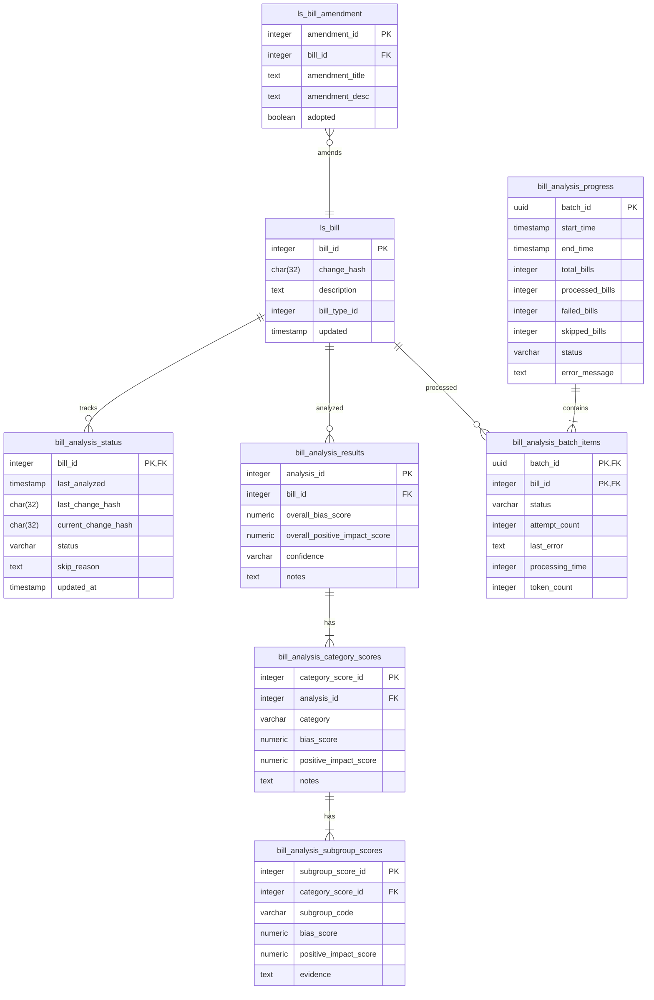

# Bill Analysis Implementation Plan

## 1. Database Schema Overview



## 2. Database Setup

### Analysis Status Tables
```sql
-- Track analysis status for each bill
CREATE TABLE bill_analysis_status (
    bill_id INTEGER PRIMARY KEY,
    last_analyzed TIMESTAMP,
    last_change_hash CHAR(32),    -- Track the change_hash we last analyzed
    current_change_hash CHAR(32),  -- Latest change_hash from ls_bill
    status VARCHAR(20),           -- 'pending', 'completed', 'skipped', 'error'
    skip_reason TEXT,             -- e.g. 'insufficient_content'
    created_at TIMESTAMP DEFAULT CURRENT_TIMESTAMP,
    updated_at TIMESTAMP DEFAULT CURRENT_TIMESTAMP
);

-- Track batch progress
CREATE TABLE bill_analysis_progress (
    progress_id SERIAL PRIMARY KEY,
    batch_id UUID NOT NULL,                    -- Unique identifier for batch run
    start_time TIMESTAMP NOT NULL,
    end_time TIMESTAMP,
    total_bills INTEGER NOT NULL,              -- Number of bills in batch
    processed_bills INTEGER DEFAULT 0,         -- Successfully processed
    failed_bills INTEGER DEFAULT 0,            -- Failed to process
    skipped_bills INTEGER DEFAULT 0,           -- Skipped due to criteria
    status VARCHAR(20) NOT NULL,               -- 'running', 'completed', 'failed'
    error_message TEXT,
    created_at TIMESTAMP DEFAULT CURRENT_TIMESTAMP,
    updated_at TIMESTAMP DEFAULT CURRENT_TIMESTAMP
);

-- Track individual bill progress within batch
CREATE TABLE bill_analysis_batch_items (
    batch_id UUID NOT NULL,
    bill_id INTEGER NOT NULL,
    status VARCHAR(20) NOT NULL,               -- 'pending', 'processing', 'completed', 'failed', 'skipped'
    attempt_count INTEGER DEFAULT 0,
    last_error TEXT,
    processing_time INTEGER,                   -- Time taken in milliseconds
    token_count INTEGER,                       -- Actual tokens used
    created_at TIMESTAMP DEFAULT CURRENT_TIMESTAMP,
    updated_at TIMESTAMP DEFAULT CURRENT_TIMESTAMP,
    PRIMARY KEY (batch_id, bill_id)
);

-- Analysis results tables
CREATE TABLE bill_analysis_results (
    analysis_id SERIAL PRIMARY KEY,
    bill_id INTEGER NOT NULL REFERENCES ls_bill(bill_id),
    overall_bias_score NUMERIC(3,2),
    overall_positive_impact_score NUMERIC(3,2),
    confidence VARCHAR(10),  -- 'High', 'Medium', 'Low'
    notes TEXT,
    created_at TIMESTAMP DEFAULT CURRENT_TIMESTAMP,
    updated_at TIMESTAMP DEFAULT CURRENT_TIMESTAMP,
    UNIQUE(bill_id)  -- One active analysis per bill
);

CREATE TABLE bill_analysis_category_scores (
    category_score_id SERIAL PRIMARY KEY,
    analysis_id INTEGER NOT NULL REFERENCES bill_analysis_results(analysis_id),
    category VARCHAR(20) NOT NULL,  -- 'race', 'religion', etc.
    bias_score NUMERIC(3,2),
    positive_impact_score NUMERIC(3,2),
    notes TEXT,
    UNIQUE(analysis_id, category)
);

CREATE TABLE bill_analysis_subgroup_scores (
    subgroup_score_id SERIAL PRIMARY KEY,
    category_score_id INTEGER NOT NULL REFERENCES bill_analysis_category_scores(category_score_id),
    subgroup_code VARCHAR(5) NOT NULL,  -- 'BH', 'AP', etc.
    bias_score NUMERIC(3,2),
    positive_impact_score NUMERIC(3,2),
    evidence TEXT,
    UNIQUE(category_score_id, subgroup_code)
);
```

### Indexes
```sql
-- Indexes for bill selection
CREATE INDEX idx_bill_type_updated ON ls_bill(bill_type_id, updated DESC);
CREATE INDEX idx_bill_description_length ON ls_bill(bill_type_id, (array_length(regexp_split_to_array(trim(description), '\s+'), 1)));
CREATE INDEX idx_bill_amendments ON ls_bill_amendment(bill_id);

-- Indexes for analysis results
CREATE INDEX idx_analysis_bill_id ON bill_analysis_results(bill_id);
CREATE INDEX idx_analysis_scores ON bill_analysis_results(overall_bias_score, overall_positive_impact_score);
CREATE INDEX idx_category_scores ON bill_analysis_category_scores(category, bias_score, positive_impact_score);
CREATE INDEX idx_subgroup_scores ON bill_analysis_subgroup_scores(subgroup_code, bias_score, positive_impact_score);

-- Indexes for progress tracking
CREATE INDEX idx_batch_progress ON bill_analysis_progress(batch_id, status);
CREATE INDEX idx_batch_items_status ON bill_analysis_batch_items(batch_id, status);
```

## 2. Bill Selection Query

```sql
-- Query to find bills with their amendments
SELECT 
    b.*,
    json_agg(
        json_build_object(
            'title', ba.amendment_title,
            'description', ba.amendment_desc,
            'adopted', (ba.adopted = 1)
        )
    ) FILTER (WHERE ba.amendment_id IS NOT NULL) as amendments
FROM ls_bill b
LEFT JOIN bill_analysis_status bas ON b.bill_id = bas.bill_id
LEFT JOIN ls_bill_amendment ba ON b.bill_id = ba.bill_id
WHERE b.bill_type_id = 1  -- Only actual bills
  AND (
    bas.bill_id IS NULL  -- New bills
    OR b.change_hash != bas.last_change_hash  -- Changed bills
  )
  AND (
    array_length(regexp_split_to_array(trim(b.description), '\s+'), 1) >= 20
    OR ba.amendment_id IS NOT NULL
  )
GROUP BY b.bill_id, b.updated
ORDER BY b.updated DESC;
```

## 3. Worker Process Flow

1. **Initialization**
   - Connect to database using `LEGISCAN_DB_URL`
   - Set appropriate transaction isolation level
   - Initialize LLM client

2. **Bill Selection**
   - Execute selection query with LIMIT based on LLM context window
   - Skip bills with insufficient content
   - Track skipped bills in analysis_status table

3. **Data Gathering**
   - For each selected bill:
     - Get bill description
     - Get amendments data:
       - Filter out unadopted amendments if needed
       - Combine amendment title and description for analysis
       - Track amendment status for context
     - Get sponsors and subjects
     - Format data according to LLM input requirements

4. **Batch Processing**
   - Process bills in batches that fit LLM context window
   - Track progress in analysis_status table
   - Handle errors and retries

5. **Result Storage**
   - Store analysis results
   - Update tracking information
   - Commit transaction

## 4. Error Handling

1. **Database Errors**
   - Connection issues
   - Transaction failures
   - Deadlock handling

2. **LLM Processing Errors**
   - Invalid responses
   - Timeout handling
   - Retry logic

3. **Content Issues**
   - Missing required fields
   - Invalid content format
   - Tracking of problematic bills

## 5. LLM Context Window Management

### Token Size Calculation
1. **Input Format Size** (approximate tokens)
   - Each bill requires:
     - bill_id: ~3 tokens
     - status: ~5 tokens
     - description: variable (max 500 tokens)
     - sponsors: ~12 tokens per sponsor
     - subjects: ~8 tokens per subject
     - amendments: per amendment:
       - title: ~25 tokens
       - description: ~100 tokens
       - adopted status: ~2 tokens
       - JSON structure: ~8 tokens
   - JSON structure overhead: ~6 tokens per bill

2. **Batch Size Calculator**
```typescript
interface BillTokenEstimate {
  descriptionTokens: number;
  sponsorsCount: number;
  subjectsCount: number;
  amendmentsCount: number;
}

class BatchSizeCalculator {
  private readonly TOKENS_PER_SPONSOR = 12;
  private readonly TOKENS_PER_SUBJECT = 8;
  private readonly TOKENS_PER_AMENDMENT = 125;
  private readonly JSON_OVERHEAD = 6;
  private readonly SAFETY_MARGIN = 0.8; // Use 80% of available space

  constructor(
    private readonly contextWindowTokens: number = 128000,  // 128K context window
    private readonly promptOverheadTokens: number = 1000
  ) {}

  calculateBillTokens(bill: BillTokenEstimate): number {
    return (
      3 + // bill_id
      5 + // status
      bill.descriptionTokens +
      (this.TOKENS_PER_SPONSOR * bill.sponsorsCount) +
      (this.TOKENS_PER_SUBJECT * bill.subjectsCount) +
      (this.TOKENS_PER_AMENDMENT * bill.amendmentsCount) +
      this.JSON_OVERHEAD
    );
  }

  getQueryLimit(): number {
    // Conservative average bill size estimate
    const averageBill: BillTokenEstimate = {
      descriptionTokens: 500,  // Max description tokens
      sponsorsCount: 2,        // Average sponsors
      subjectsCount: 3,        // Average subjects
      amendmentsCount: 1       // Average amendments
    };

    const tokensPerBill = this.calculateBillTokens(averageBill);
    const availableTokens = (this.contextWindowTokens - this.promptOverheadTokens) * this.SAFETY_MARGIN;
    
    return Math.floor(availableTokens / tokensPerBill);
  }
}
```

### Implementation Notes
1. Worker Configuration:
   ```env
   LLM_CONTEXT_TOKENS=128000    # 128K context window
   LLM_PROMPT_TOKENS=1000       # Reserved for system prompt
   ```

2. Runtime Monitoring:
   - Track actual token counts vs estimates
   - Log when batches exceed 70% of context window
   - Adjust estimates based on real usage data

## 6. Batch Processing Strategy

### Message Structure
We will use a single message containing an array of bills for each batch because:
1. Efficient use of context window
2. Enables comparative analysis across bills
3. Matches our input/output schema design
4. Reduces number of API calls

```typescript
interface BatchRequest {
  bills: Array<{
    bill_id: string;
    status: string;
    description: string;
    sponsors: Array<{
      party: string;
      type: string;
    }>;
    subjects: string[];
    amendments: Array<{
      title: string;
      description: string;
      adopted: boolean;
    }>;
  }>;
}
```

### Batch Processing Flow
1. **Batch Assembly**
   - Use BatchSizeCalculator to determine bill limit
   - Query bills up to limit
   - Format as single JSON array
   - Validate total token count before sending

2. **Error Handling**
   - On batch failure:
     - Log full batch attempt
     - Reduce batch size by 50%
     - Retry with smaller batch
     - If single bill batch fails, mark bill as error

3. **Success Tracking**
   - Record successful batch sizes
   - Gradually increase batch size if success rate is high
   - Track token usage vs estimates

### Implementation Notes
1. **Batch Size Adjustment**
   ```typescript
   class BatchProcessor {
     private currentBatchSize: number;
     private readonly minBatchSize = 1;
     private successfulBatches = 0;
     
     async processBatch(bills: Bill[]): Promise<void> {
       try {
         await this.sendTollm(bills);
         this.handleSuccess();
       } catch (error) {
         await this.handleBatchError(bills, error);
       }
     }

     private async handleBatchError(bills: Bill[], error: Error): Promise<void> {
       if (bills.length > this.minBatchSize) {
         // Split batch and retry
         const halfSize = Math.floor(bills.length / 2);
         await this.processBatch(bills.slice(0, halfSize));
         await this.processBatch(bills.slice(halfSize));
       } else {
         // Single bill failed
         await this.markBillError(bills[0], error);
       }
     }
   }
   ```

2. **Monitoring Metrics**
   - Average successful batch size
   - Batch failure rate
   - Token utilization per batch
   - Processing time per batch

## 7. Analysis Results Storage

### Common UI Queries

1. **List View Query** (with filters)
```sql
SELECT 
    b.bill_id,
    b.bill_number,
    b.description,
    bar.overall_bias_score,
    bar.overall_positive_impact_score,
    bar.confidence
FROM ls_bill b
JOIN bill_analysis_results bar ON b.bill_id = bar.bill_id
WHERE 
    ($1::numeric IS NULL OR bar.overall_bias_score >= $1)
    AND ($2::numeric IS NULL OR bar.overall_positive_impact_score >= $2)
    AND ($3::varchar IS NULL OR bar.confidence = $3)
ORDER BY b.updated DESC;
```

2. **Detailed Analysis View Query**
```sql
WITH category_scores AS (
    SELECT 
        bacs.category,
        bacs.bias_score,
        bacs.positive_impact_score,
        json_agg(json_build_object(
            'subgroup_code', bass.subgroup_code,
            'bias_score', bass.bias_score,
            'positive_impact_score', bass.positive_impact_score,
            'evidence', bass.evidence
        )) as subgroups
    FROM bill_analysis_category_scores bacs
    LEFT JOIN bill_analysis_subgroup_scores bass 
        ON bacs.category_score_id = bass.category_score_id
    WHERE bacs.analysis_id = $1
    GROUP BY bacs.category, bacs.bias_score, bacs.positive_impact_score
)
SELECT 
    bar.*,
    json_agg(cs.*) as categories
FROM bill_analysis_results bar
LEFT JOIN category_scores cs ON true
WHERE bar.bill_id = $1
GROUP BY bar.analysis_id;
```

### Implementation Notes

1. **Data Access Patterns**
   - List view with pagination and filters
   - Detailed view with full category/subgroup hierarchy
   - Aggregate statistics for dashboards
   - Historical analysis tracking

2. **Performance Considerations**
   - Denormalized scores at each level for efficient filtering
   - JSON aggregation for hierarchical data retrieval
   - Indexes aligned with common filter combinations

3. **UI Requirements**
   - Filter by overall scores
   - Filter by specific category scores
   - Filter by confidence level
   - Sort by various score types
   - Full text search on evidence

### Performance Optimizations

Note: View creation will be driven by UI integration design requirements. We will:
1. Start with base tables and indexes
2. Monitor query patterns from UI integration
3. Create optimized views based on actual usage data
4. Consider materialized views if/when needed based on performance metrics

## 8. Update Strategy

### Approach: Full Refresh on Changes
When a bill's change_hash differs, we will:

```sql
BEGIN;
  -- 1. Delete existing analysis
  DELETE FROM bill_analysis_subgroup_scores 
  WHERE category_score_id IN (
    SELECT category_score_id 
    FROM bill_analysis_category_scores
    WHERE analysis_id = (
      SELECT analysis_id 
      FROM bill_analysis_results 
      WHERE bill_id = $1
    )
  );
  
  DELETE FROM bill_analysis_category_scores
  WHERE analysis_id = (
    SELECT analysis_id 
    FROM bill_analysis_results 
    WHERE bill_id = $1
  );
  
  DELETE FROM bill_analysis_results
  WHERE bill_id = $1;

  -- 2. Update status to pending reanalysis
  UPDATE bill_analysis_status
  SET status = 'pending',
      last_change_hash = current_change_hash,
      updated_at = CURRENT_TIMESTAMP
  WHERE bill_id = $1;

  -- 3. Insert new analysis results
  INSERT INTO bill_analysis_results (
    bill_id, 
    overall_bias_score,
    overall_positive_impact_score,
    confidence,
    notes
  ) VALUES ($1, $2, $3, $4, $5)
  RETURNING analysis_id;

  -- 4. Insert category scores
  INSERT INTO bill_analysis_category_scores (...) VALUES (...);

  -- 5. Insert subgroup scores
  INSERT INTO bill_analysis_subgroup_scores (...) VALUES (...);

  -- 6. Update status to completed
  UPDATE bill_analysis_status
  SET status = 'completed',
      last_analyzed = CURRENT_TIMESTAMP,
      updated_at = CURRENT_TIMESTAMP
  WHERE bill_id = $1;

COMMIT;
```

Rationale for transactional refresh:
1. Ensures data consistency - no partial updates
2. Maintains referential integrity
3. Allows rollback if any step fails
4. Prevents orphaned records
5. Status tracking is synchronized with analysis data

Note: The transaction will:
- Delete old analysis
- Update tracking status
- Insert new analysis
- Update completion status
All in one atomic operation

## 9. Progress Tracking Strategy

### Progress Update Flow
1. **Batch Initialization**
```typescript
async function initializeBatch(bills: Bill[]): Promise<string> {
  const batchId = uuid();
  
  await db.transaction(async (trx) => {
    // Create progress record
    await trx('bill_analysis_progress').insert({
      batch_id: batchId,
      start_time: new Date(),
      total_bills: bills.length,
      status: 'running'
    });

    // Create batch items
    await trx('bill_analysis_batch_items')
      .insert(bills.map(bill => ({
        batch_id: batchId,
        bill_id: bill.bill_id,
        status: 'pending'
      })));
  });

  return batchId;
}
```

2. **Progress Updates**
```typescript
async function updateBillProgress(
  batchId: string, 
  billId: number, 
  status: string,
  metrics?: {
    processingTime?: number;
    tokenCount?: number;
    error?: string;
  }
): Promise<void> {
  await db.transaction(async (trx) => {
    // Update batch item
    await trx('bill_analysis_batch_items')
      .where({ batch_id: batchId, bill_id: billId })
      .update({
        status,
        processing_time: metrics?.processingTime,
        token_count: metrics?.tokenCount,
        last_error: metrics?.error,
        attempt_count: db.raw('attempt_count + 1'),
        updated_at: new Date()
      });

    // Update batch progress counts
    await updateBatchProgress(batchId, trx);
  });
}
```

3. **Batch Completion**
```typescript
async function completeBatch(batchId: string): Promise<void> {
  await db.transaction(async (trx) => {
    const counts = await trx('bill_analysis_batch_items')
      .where({ batch_id: batchId })
      .select(db.raw(`
        COUNT(*) FILTER (WHERE status = 'completed') as processed,
        COUNT(*) FILTER (WHERE status = 'failed') as failed,
        COUNT(*) FILTER (WHERE status = 'skipped') as skipped
      `))
      .first();

    await trx('bill_analysis_progress')
      .where({ batch_id: batchId })
      .update({
        end_time: new Date(),
        processed_bills: counts.processed,
        failed_bills: counts.failed,
        skipped_bills: counts.skipped,
        status: counts.failed > 0 ? 'completed_with_errors' : 'completed',
        updated_at: new Date()
      });
  });
}
```

### Progress Monitoring Queries
```sql
-- Get current batch status
SELECT 
    batch_id,
    total_bills,
    processed_bills,
    failed_bills,
    skipped_bills,
    status,
    EXTRACT(EPOCH FROM (end_time - start_time)) as duration_seconds
FROM bill_analysis_progress
WHERE batch_id = $1;

-- Get failed bills from batch
SELECT 
    bill_id,
    attempt_count,
    last_error,
    processing_time
FROM bill_analysis_batch_items
WHERE batch_id = $1 AND status = 'failed';

-- Get processing statistics
SELECT 
    AVG(processing_time) as avg_processing_time,
    AVG(token_count) as avg_token_count,
    MAX(processing_time) as max_processing_time,
    MAX(token_count) as max_token_count
FROM bill_analysis_batch_items
WHERE batch_id = $1 AND status = 'completed';
```

## Next Steps

1. [ ] Create database tables and indexes
2. [ ] Implement worker process
3. [ ] Add error handling
4. [ ] Add monitoring
5. [ ] Test with sample bills

## Questions to Resolve

1. What is the optimal batch size for LLM processing?
2. How should we handle retry attempts?
3. What monitoring metrics should we track?
