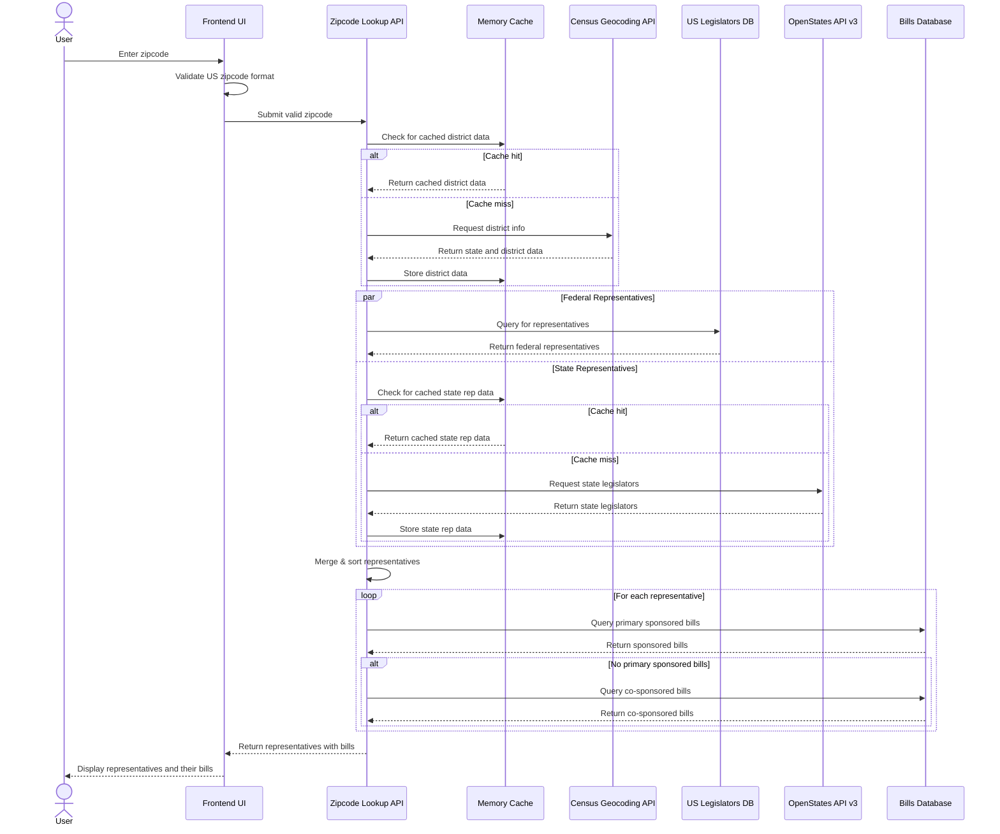
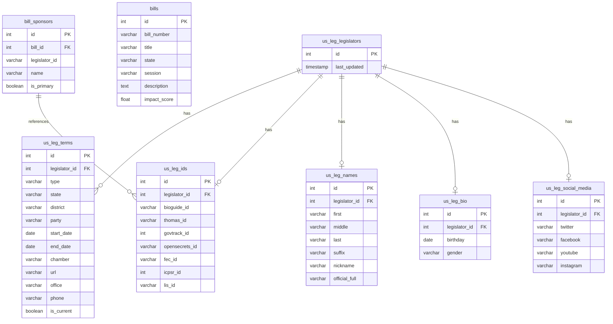

# Lookup Sponsor Zipcode

## Overview
Define the requirements for the lookup sponsor zipcode feature.  

## Requirements
1. We need to provide a component that captures a zipcode.
2. We need to validate that the zipcode is a valid US zipcode.
3. The system will redirect the user to a page where we display a list of representatives and three of the bills that are the most impactful to the zipcode that the sponsor is the primary sponsor.
4. The order of should be US congress, state congress, and local congress.
5. The list of representatives should be sorted by seniority.
6. If representatives are found but are not the primary sponsor to any bill, then we show the their impactful co-sponsored bills.

Sponsor data details:
1. Sponsor name
2. Sponsor party
3. Sponsor state
4. Sponsor zipcode
5. Sponsor type (state or federal)
6. District number
7. Link to sponsor's profile page.
8. Overview of the sponsor's impact on bills (same as the sponsor page)

Bill data details:
1. Bill title
2. Bill number
3. Bill Overall Impact Score
4. Link to bill page
5. Primary or co-sponsor badge

## Data Model

### US Legislators Database
For this feature, we will create a new set of tables with the `us_leg_` prefix to store federal representative data from the United States Legislators Database on GitHub. This data will be imported periodically via an external scheduler.

The schema includes:
- `us_leg_legislators`: Core table with legislator IDs
- `us_leg_terms`: Terms served by legislators (including current positions)
- `us_leg_ids`: Various external identifiers (bioguide, govtrack, etc.)
- `us_leg_names`: Name variations (official, nickname, etc.)
- `us_leg_bio`: Biographical information
- `us_leg_social_media`: Social media accounts

### Connection to Bill Data
The existing bill data will be connected through the `bill_sponsors` table, where the `legislator_id` field corresponds to the `bioguide_id` in our `us_leg_ids` table. This allows us to:

1. Look up representatives by district (from zipcode)
2. Find bills sponsored or co-sponsored by those representatives
3. Display impact scores for those bills

### State Legislator Data
For state-level legislators, we'll use the OpenStates API v3 rather than storing this data locally. This data will be:
- Retrieved on-demand when a user enters a zipcode
- Cached in memory to improve performance
- Merged with federal representative data for display

### External Data Sources
- Census Geocoding API: Converts zipcodes to districts
- United States Legislators Database (GitHub): Source for federal legislator data
- OpenStates API v3: Source for state legislator data

For bill impact scores, we'll use the existing impact score calculation methods documented in @002-bill-analysis-impact-scores.md.

## Zipcode to Representative lookup

### API Implementation Strategy

We will implement a composite service that uses the United States Legislators Database from GitHub as our primary data source for federal representatives, along with Census Geocoding API for district lookup and OpenStates API for state legislature representatives.

#### Step 1: Database Schema for US Legislators

We will create a normalized database schema with `us_leg_` prefix for all tables:

```sql
-- Core legislator information
CREATE TABLE us_leg_legislators (
  id SERIAL PRIMARY KEY,
  last_updated TIMESTAMP DEFAULT CURRENT_TIMESTAMP
);

-- Terms served by legislators
CREATE TABLE us_leg_terms (
  id SERIAL PRIMARY KEY,
  legislator_id INTEGER REFERENCES us_leg_legislators(id),
  type VARCHAR(10), -- 'rep', 'sen'
  state VARCHAR(2),
  district VARCHAR(10),
  party VARCHAR(50),
  start_date DATE,
  end_date DATE,
  chamber VARCHAR(20), -- 'house', 'senate'
  url VARCHAR(255),
  office VARCHAR(255),
  phone VARCHAR(20),
  is_current BOOLEAN DEFAULT FALSE
);

-- Various external identifiers
CREATE TABLE us_leg_ids (
  id SERIAL PRIMARY KEY,
  legislator_id INTEGER REFERENCES us_leg_legislators(id),
  bioguide_id VARCHAR(20), -- Primary ID used in the system
  thomas_id VARCHAR(20),
  govtrack_id INTEGER,
  opensecrets_id VARCHAR(20),
  fec_id VARCHAR(20),
  icpsr_id INTEGER,
  lis_id VARCHAR(20)
);

-- Name variations
CREATE TABLE us_leg_names (
  id SERIAL PRIMARY KEY,
  legislator_id INTEGER REFERENCES us_leg_legislators(id),
  first VARCHAR(100),
  middle VARCHAR(100),
  last VARCHAR(100),
  suffix VARCHAR(20),
  nickname VARCHAR(100),
  official_full VARCHAR(200)
);

-- Biographical information
CREATE TABLE us_leg_bio (
  id SERIAL PRIMARY KEY,
  legislator_id INTEGER REFERENCES us_leg_legislators(id),
  birthday DATE,
  gender VARCHAR(1)
);

-- Social media accounts
CREATE TABLE us_leg_social_media (
  id SERIAL PRIMARY KEY,
  legislator_id INTEGER REFERENCES us_leg_legislators(id),
  twitter VARCHAR(100),
  facebook VARCHAR(100),
  youtube VARCHAR(100),
  instagram VARCHAR(100)
);
```

#### Step 2: Zipcode to District using Census API

We'll still use the Census Geocoding API to convert a zipcode to congressional district information:

```
GET https://geocoding.geo.census.gov/geocoder/geographies/address?street=&city=&state=&zip={ZIPCODE}&benchmark=2020&vintage=2020&layers=all&format=json
```

**Example Request:**
```
GET https://geocoding.geo.census.gov/geocoder/geographies/address?street=&city=&state=&zip=20500&benchmark=2020&vintage=2020&layers=all&format=json
```

This will provide the congressional district information we need to query our representatives database.

#### Step 3: Representatives Lookup from Database

Once we have the district information, we can query our database to find the appropriate representatives:

```sql
-- Example query to find representatives by state and district
SELECT
  n.official_full AS name,
  t.party,
  t.state,
  t.district,
  t.chamber,
  t.office,
  t.phone,
  t.url AS website,
  s.twitter,
  s.facebook
FROM
  us_leg_terms t
JOIN
  us_leg_legislators l ON t.legislator_id = l.id
JOIN
  us_leg_names n ON n.legislator_id = l.id
LEFT JOIN
  us_leg_social_media s ON s.legislator_id = l.id
WHERE
  t.is_current = TRUE
  AND t.state = :state
  AND (
    (t.chamber = 'house' AND t.district = :district)
    OR t.chamber = 'senate'
  )
ORDER BY
  t.chamber DESC, -- Senate first, then House
  t.start_date ASC; -- Sort by seniority
```

#### Step 4: State Legislature Representatives from OpenStates API v3

We will use the OpenStates API v3 for state legislature representatives data. The API credentials are configured as environment variables:

```
OPENSTATES_API_URL=https://v3.openstates.org/
```

**API Endpoint:**
```
GET https://v3.openstates.org/people?district={STATE_DISTRICT}&jurisdiction={STATE}&include=sources
```

**Example Request:**
```
GET https://v3.openstates.org/people?district=6&jurisdiction=ca&include=sources
```

**Headers:**
```
X-API-Key: ${process.env.OPENSTATES_API_KEY}
```

**OpenStates API v3 Notes:**
- The API uses `jurisdiction` parameter instead of `state` (which was used in older versions)
- The API returns detailed information about state legislators, including their roles, contact information, and social media accounts
- The `include=sources` parameter ensures we get additional source information
- Additional filter parameters like `org_classification` can be used to filter by chamber (e.g., upper/lower house)

**Implementation Approach:**
```typescript
// Example implementation for fetching state representatives
async function fetchStateRepresentatives(state: string, district: string) {
  const url = new URL(`${process.env.OPENSTATES_API_URL}people`);
  url.searchParams.append('jurisdiction', state.toLowerCase());
  url.searchParams.append('district', district);
  url.searchParams.append('include', 'sources');
  
  const response = await fetch(url.toString(), {
    headers: {
      'X-API-Key': process.env.OPENSTATES_API_KEY
    }
  });
  
  if (!response.ok) {
    throw new Error(`OpenStates API error: ${response.status}`);
  }
  
  const data = await response.json();
  return data.results || [];
}
```

#### Step 5: Composite Implementation

Our service will:

1. Take a zipcode input
2. Query the Census API to get district information
3. Use district data to query our database for federal representatives
4. Use district data to query OpenStates API v3 for state representatives
5. Transform and normalize all data into a consistent format
6. Sort by level of government and seniority
7. Query our database for sponsored and co-sponsored bills

### Error Handling

The implementation should account for:
1. Invalid zipcodes
2. Missing district information
3. API rate limiting
4. Representatives without available data

### Memory-based Caching Strategy

To improve performance:
1. Cache district information by zipcode
2. Cache OpenStates API responses
3. Implement memory-based caching with appropriate TTL values

**Caching Implementation:**
```typescript
// Simple in-memory cache
const cache = new Map();
const CACHE_TTL = 3600000; // 1 hour in milliseconds

function getCachedData(key: string) {
  const cachedItem = cache.get(key);
  if (cachedItem && Date.now() - cachedItem.timestamp < CACHE_TTL) {
    return cachedItem.data;
  }
  return null;
}

function setCachedData(key: string, data: any) {
  cache.set(key, { data, timestamp: Date.now() });
}
```

## Map Representation to Bill

### API Implementation Strategy

We will leverage the existing trigram search functionality to connect representatives to their sponsored bills. This approach has several advantages:

1. It allows us to use the same search infrastructure that powers our main search feature
2. It provides fuzzy matching to handle name variations and potential data inconsistencies
3. It's already optimized for performance with appropriate database indexes

#### Step 1: Representative-to-Sponsor Matching

We'll use our us_leg_ tables to find representatives by district, and then use trigram similarity to find matching sponsors in the existing vector_index table:

```typescript
// Optimized approach for matching representatives to existing sponsors in vector_index
async function matchRepresentativeToSponsor(repName, state) {
  // Generate meaningful tokens from rep name for pre-filtering
  const meaningfulWords = removeStopwords(repName.toLowerCase().split(' '));
  
  // Generate ILIKE conditions for pre-filtering
  const tokens = meaningfulWords
    .map((word) => `search_text ILIKE '%${word}%'`)
    .join(' AND ');
  
  // Use optimized trigram search pattern from search API
  const sponsorMatchQuery = `
    WITH pre_filtered AS (
      SELECT 
        vi.entity_type,
        vi.entity_id,
        vi.entity_uuid,
        vi.search_text,
        vi.state_abbr,
        vi.state_name
      FROM vector_index vi
      WHERE ${tokens}
      AND vi.entity_type = 'sponsor'
      AND vi.state_abbr = $1
      ORDER BY LENGTH(vi.search_text) ASC
      LIMIT 100
    ),
    ranked AS (
      SELECT 
        entity_type,
        entity_id,
        entity_uuid,
        search_text,
        state_abbr,
        state_name,
        word_similarity($2, search_text) AS similarity
      FROM pre_filtered
      WHERE word_similarity($2, search_text) > 0.3
      ORDER BY similarity DESC
      LIMIT 1
    )
    SELECT * FROM ranked
  `;
  
  const sponsorMatches = await db.unsafe(sponsorMatchQuery, [state, repName]);
  return sponsorMatches.length > 0 ? sponsorMatches[0] : null;
}
```

#### Step 2: Bill Retrieval for Matched Sponsors

For each representative where we find a matching sponsor in the vector_index table, we'll retrieve their sponsored bills:

```typescript
// For representatives with matching sponsors, find their bills
async function getBillsForSponsor(sponsorId) {
  // First try to find primary sponsored bills
  const primaryBillsQuery = `
    SELECT 
      b.bill_id,
      b.bill_number,
      b.title,
      b.description,
      b.impact_score,
      bs.is_primary
    FROM 
      ls_bill_sponsor bs
    JOIN 
      lsv_bill b ON bs.bill_id = b.bill_id
    WHERE 
      bs.people_id = $1
      AND bs.is_primary = TRUE
    ORDER BY 
      b.impact_score DESC
    LIMIT 3
  `;
  
  let sponsoredBills = await db.unsafe(primaryBillsQuery, [sponsorId]);
  
  // If no primary bills, get co-sponsored bills
  if (sponsoredBills.length === 0) {
    const coBillsQuery = `
      SELECT 
        b.bill_id,
        b.bill_number,
        b.title,
        b.description,
        b.impact_score,
        bs.is_primary
      FROM 
        ls_bill_sponsor bs
      JOIN 
        lsv_bill b ON bs.bill_id = b.bill_id
      WHERE 
        bs.people_id = $1
        AND bs.is_primary = FALSE
      ORDER BY 
        b.impact_score DESC
      LIMIT 3
    `;
    
    sponsoredBills = await db.unsafe(coBillsQuery, [sponsorId]);
  }
  
  return sponsoredBills;
}
```

#### Step 3: Complete Implementation

The final implementation combines district-based representative lookup with sponsor matching and bill retrieval:

```typescript
// Pseudocode for the zipcode-to-representatives-with-bills API
async function getRepresentativesWithBillsByZipcode(zipcode) {
  // 1. Get district info from Census API
  const districtInfo = await fetchDistrictFromCensus(zipcode);
  
  // 2. Get federal representatives from us_leg_ tables by district
  const federalReps = await getFederalRepresentatives(
    districtInfo.state,
    districtInfo.district
  );
  
  // 3. Get state representatives from OpenStates API
  const stateReps = await getStateRepresentatives(
    districtInfo.state,
    districtInfo.stateLegislativeDistrict
  );
  
  // 4. For each representative, try to find matching sponsor and bills
  const federalRepsWithBills = await Promise.all(
    federalReps.map(async (rep) => {
      // Try to find matching sponsor in vector_index
      const sponsorMatch = await matchRepresentativeToSponsor(rep.name, rep.state);
      
      // Get bills if sponsor match found, otherwise return empty array
      const bills = sponsorMatch 
        ? await getBillsForSponsor(sponsorMatch.entity_id)
        : [];
      
      return {
        ...rep,
        bills: bills,
        hasMatchingSponsor: !!sponsorMatch
      };
    })
  );
  
  // 5. For state reps, follow similar pattern
  const stateRepsWithBills = await Promise.all(/* similar implementation for state reps */);
  
  // 6. Combine and sort all representatives
  const allReps = [
    ...federalRepsWithBills,
    ...stateRepsWithBills
  ].sort(/* sorting logic by level, chamber, seniority */);
  
  return allReps;
}
```

### Important Notes

1. **Read-Only Approach**: This implementation only reads from the existing vector_index table and does not modify it in any way.

2. **Graceful Handling of Unmatched Representatives**: 
   - All representatives from the us_leg_ tables will be displayed in the UI
   - Only representatives with matching sponsors in vector_index will have bill information
   - The UI should handle representatives without matching bills appropriately

3. **Performance Considerations**:
   - The trigram search uses the same optimized pattern as the main search API
   - Pre-filtering by state and using ILIKE conditions reduces the search space
   - Appropriate limits at each step prevent excessive processing

## UI/UX Design

The UI will be a simple form with a zipcode input field and a submit button.  When the user submits the form, the zipcode will be validated and the representatives and bills will be displayed.

The form will be a component that can be reused in other pages.

The form still be submitted to a new page that will display the representatives and bills.
The representatives and bills will be displayed in a table with the following columns:
1. Representative Name
2. Bio image
3. Representative Party
4. Representative State
5. Representative Zipcode
6. Representative Type (state or federal)
7. Representative District Number
8. Representative Link to Profile Page

The bills will be displayed in a table with the following columns up to 3 for each representative:
1. Bill Title
2. Bill Number
3. Bill Overall Impact Score
4. Link to Bill Page
5. Primary or Co-sponsor Badge

## System Flow Diagram



## Database Schema Diagram


